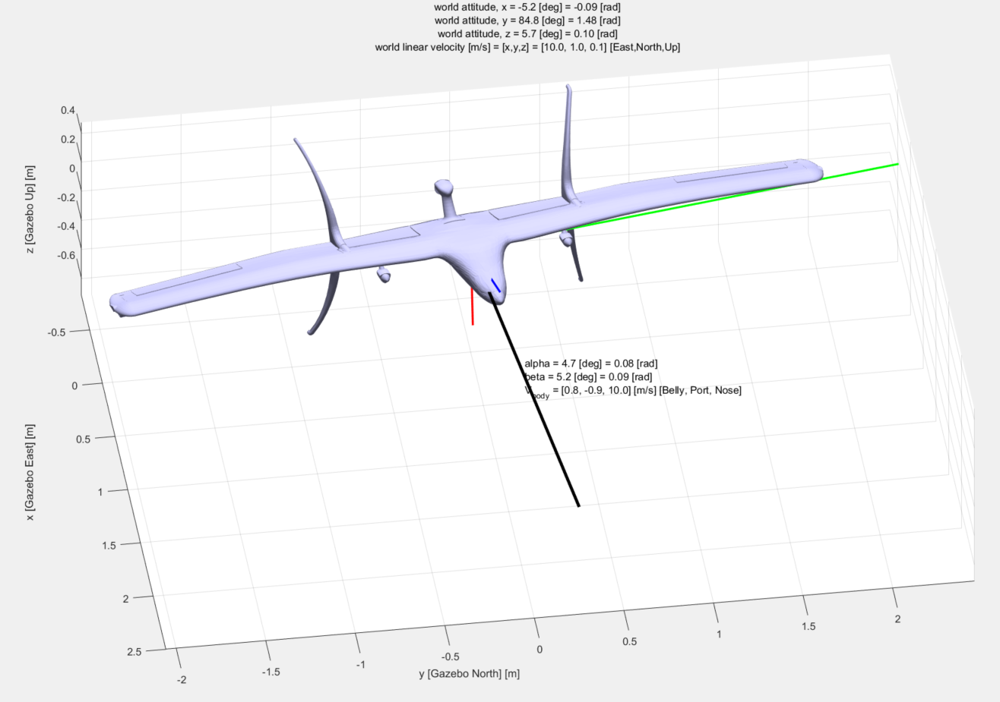
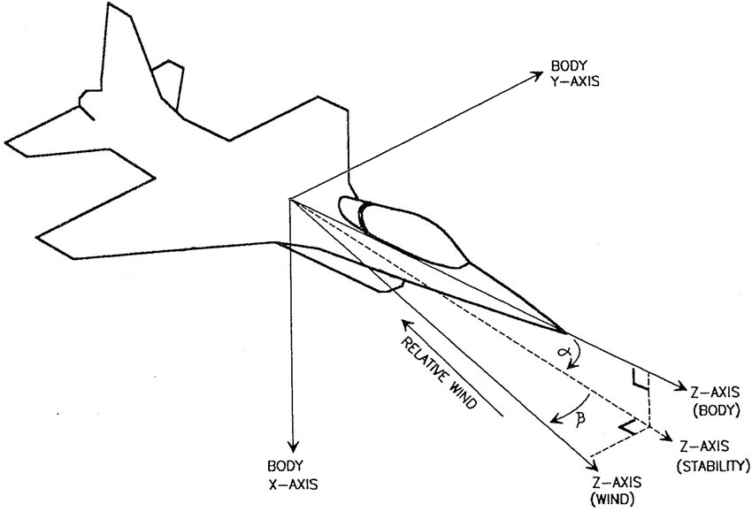
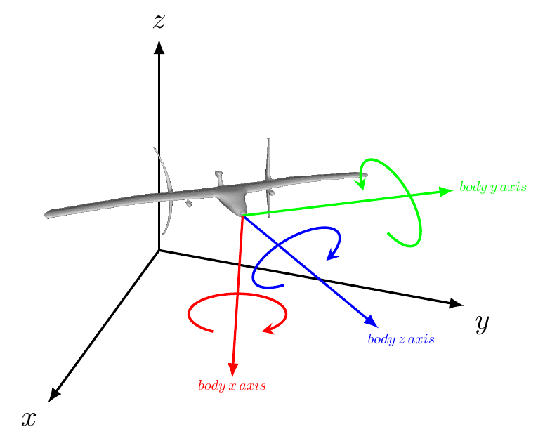

# LiftDrag Plugin

## Introduction

###### Summary

This document describes an improved version of the aerodynamic model used to calculate lift and drag forces.

The main improvement from the previous aerodynamic model available in Gazebo [1], is replacing a single $\frac{C_L}{\alpha}$ slope coefficient and associated ${C_L}_{max}$ with an aerodynamic lookup table where, for each $\alpha$ there exists an associated $C_L$ and $C_D$.  The main benefit of this new method is that it allows reasonable estimates of aerodynamic parameters up to and past stall, i.e. ${C_L}_{max}$. This is particularly important for tailsitting transition vehicles that operate in the range $0 < \alpha < 90$ and beyond.

###### Nomenclature - Derivation

Names in *thin italics* refer to variable names as they appear in the code.

$\alpha$  = *alpha*, angle-of-attack [deg]. The angle between freestream and the body aircraft body coordinate system.  Calculated as the angle between, on one hand, the `<forward>` direction unit vector and the component of the oncoming airflow which resides in the plane defined by the `<forward>` and  `<upward>` tags, on the other.  Both tags are define in aircraft SDF file.  Positive $\alpha$  = “alpha” (wind frame) is ‘nose up’ $^1$. 

$\beta$ = *beta*, sideslip angle [deg]. The angle between the oncoming air and the body aircraft body coordinate system.  Calculated as the angle between `<forward>` 

-  *beta* is positive, $\beta > 0$ , when the relative wind is coming from the right of the nose of the airplane.

$A$ = aerodynamic surface area of link [$m^2$]. Used for calculations of lift and drag.

$C_L$ = lift coefficient

${C_L}_{\alpha=0}$ = lift coefficient when $\alpha$ = 0.

$F_{fwd}$ = scalar force in the <forward> direction of the aircraft body-fixed frame. 

$F_R$ = resultant 3 element force vector, in body-fixed coordinate frame where $F_R = [F_x, F_y, F_z]$ [N]

$F_{up}$ = scalar force in the <upward> direction of the aircraft body-fixed frame.

$F_x$ = resultant force component in body-fixed coordinate frame x direction.

$F_y$ = resultant force component in body-fixed coordinate frame y direction.

$F_z$ = resultant force component in body-fixed coordinate frame z direction.

$LUT$ = aerodynamic coefficient lookup table with column vectors  $[{\alpha_{LUT}}, C_{L_{LUT}}, C_{D_{LUT}}]$.

$pitch$ = rotation about aircraft body-fixed coordinate system $y_b$ axis, with respect to the world frame.

$roll$ = rotation about aircraft body-fixed coordinate system $x_b$ axis, with respect to the world frame.

$\vec{u}_{fwd}$ = unit vector in the 'forward' direction of nominal lift force in body-fixed coordinate system.

$\vec{u}_{lat}$ = unit vector in the 'lateral' direction of nominal sideslip force in body-fixed coordinate system.

$\vec{u}_{up}$ = unit vector in the 'upward' direction of nominal drag force in body-fixed coordinate system.

$V_{body}$ = *body velocity* [m/s].  Three element vector representing the velocity of aircraft in body frame: [,${{V_{body}}_x},{{V_{body}}_y},{{V_{body}}_z}]$ where:

​			${{V_{body}}_x}$  = aircraft velocity in body-fixed frame x direction [m/s].

​			${{V_{body}}_y}$  = aircraft velocity in body-fixed frame y direction [m/s].

​			${{V_{body}}_z}$  = aircraft velocity in body-fixed frame z direction [m/s].

$V_{planar}$ = planar body velocity [m/s].  

$V_{world}$ = world linear velocity [m/s]. Three element vector representing the velocity of aircraft in Gazebo coordinates: [X, Y, Z] = [East, North, Up]

$V_{\infty}$ = aircraft freestream velocity [m/s]. Scalar magnitude of the aircraft freestream velocity. Calculated as vector norm of $V_{body}$.

$V_{lat}$ = Aircraft lateral velocity

$x_b$ = aircraft fixed-coordinate system x axis. Rotation about this axis is $roll$. 

$x_{vel}$ = aircraft x velocity in the world frame, i.e. 'East' [m/s]

$x_w$ = x position in the world frame, i.e. 'East' [m]

$y_b$ = aircraft fixed-coordinate system y axis. Rotation about this axis is $pitch$.

$y_{vel}$ = y velocity in the world frame, i.e. 'North' [m/s]

$y_w$ = y position in the world frame, i.e. 'North' [m]

$yaw$ = rotation about aircraft body-fixed coordinate system $x_b$ axis, with respect to the world frame.

$z_{vel}$ = z velocity in the world frame, i.e. 'Up' [m]

$z_w$ = z position in the world frame, i.e. 'Up' [m]

$z_b$ = aircraft fixed-coordinate system z axis. Rotation about this axis is $yaw$.

$F_w$ = Forward rotated wing pose vector

$U_w$ = Upward rotated wing pose vector

$R_w$ = Lateral rotated wing pose vector

$Q$ = Quaternion representation of rotation about aircraft body-fixed coordinate system

$q_{roll}$ = Quaternion representation of $roll$

$q_{pitch}$ = Quaternion representation of $pitch$

$q_{yaw}$ = Quaternion representation of $yaw$

*drag* =  The force acting opposite to the relative motion of the aircraft

*lift* = The force that directly opposes the weight of an airplane and holds the airplane in the air.

*body velocity* = XYZ velocity, through the gazebo world, in the body coordinate system. Units: [m/s]

*pose* = pose, in the Gazebo world, [x position, y position, z position, roll, pitch, yaw] where units are [ [m] [m] [m] [rad] [rad] [rad]]. First three elements are in the Gazebo World Frame and second three elements are rotations around the X, Y, and Z body coordinate axis, respectively. See [2] for details.

*world linear velocity* = velocity of the vehicle through the Gazebo world, in the Gazebo world coordinate system, i.e. [East, North, Up]. Units: [m/s].  See [3] for details.

*link* =a rigid body entity, defined in Gazebo, that contains information on inertia, visual and collision properties of a rigid body.

*LiftDrag Model* = C++ class in *avionics_sim* library responsible for calculation of forces and related values. Each instance of the LiftDrag plugin has an instance of the LiftDrag Model.

###### Coordinate System Notes

There are three primary coordinate systems (also known as 'reference frames') in use in this plugin:

1. **World / Inertial Coordinate System**

   This is the Gazebo inertial coordinate system, fixed with respect to the Gazebo world. [https://www.ros.org/reps/rep-0103.html]  It uses [X, Y, Z] = [East, North, Up] and is in meters. When using in conjunction with PX4, origin of this coordinate system is set at simulation start as an environment variables `PX4_HOME_LAT`, `PX4_HOME_LON`, and `PX4_HOME_ALT`.  For more information about PX4-Gazebo simulation, see [https://dev.px4.io/master/en/simulation/gazebo.html]

2. **Aircraft Body-Fixed Coordinate System (ABCS)**

   This coordinate system  is fixed with respect to the body. In our case we've chosen to use [X,Y,Z] = [Belly, Port, Nose].  In principle there is no reason a different convention couldn't be used for ABCS, although this has not been tested and care would have to be taken to set the `<forward>` and `<upward>` tags correctly.  These are set in the call to the lift drag plugin, from within the vehicle SDF file. 

   

   

3. **Aerodynamic (or "Wind") Reference Frame**

   This coordinate system is fixed with respect to the oncoming airflow (i.e. "freestream") onto the aircraft. It's components are typically labeled [u, v, w] and are parallel and perpendicular with the freestream.  Generally speaking aerodynamic forces operate along this frame where drag is parallel with freestream (but against aircraft direction of travel) and lift is perpendicular to the freestream.

##### Footers - Introduction

$^1$ In the illustration below, the axes $x$, $y$, and $z$ represent the Gazebo world axes. Arrows are pointing in direction of positive rotation.

For the purposes of Gazebo ‘*pose*’ message, ‘pitch’ i.e. rotation around the y axis (which runs through the port wingtip), positive rotation is "nose down", whereas for the purposes aerodynamics $\alpha$ , positive $\alpha$ is "nose up". 

 Coordinate naming convention is based on 'quadcopter' coordinates. 

$^2$ Future development - As of 2020-04-07 steps 1-7 are being taken in each instance of the plugin. For implementations where only one plugin is used for the entire vehicle, that is adequate. However, when the intent is to have multiple aerodynamic elements running concurrently, i.e. multiple instances of the plugin, it is better practice to only run step 4-6 for each individual plugin, but run steps 1-3 and 7 for all instances simultaneously. The effort to change this is underway.

'Frame' and 'coordinate system' are used interchangeably.

## Calculation details

### Overview 

At each simulation timestep the plugin goes through the following calculations$^2$:

1. Receive vehicle *pose* [2] and *world linear velocity* [3] from Gazebo.

2. Convert *pose* and *world linear velocity* into *body velocity* using eqn. 1.

3. Calculate aerodynamic parameters $\alpha, \beta, V_{\infty}$ , and $V_{planar}$ from the body velocity using eqn. 2-4 .

4. Calculate dynamic pressure using $q = \frac{1}{2}\rho V^2$. 

5. Utilize lookup table [see **Usage** section for LUT description], and linear interpolation to extract $C_L$ and $C_D$ as function of $\alpha$.

6. Calculate lift and drag force scalar quantities, in aerodynamic coordinate frame, using eqn. 14 & 15.

7. Calculate drag due to side slip.

8. Convert scalar force lift, drag, and sideslip drag representations from wind frame into body-fixed coordinate system using eqn 17.

9. Convert scalar body force representation into a 3 element vector representation in body frame. 

10. Apply the aerodynamic force, in body frame, to the vehicle through Gazebo API calls.

    

### Equations Introduction

Convert *pose* and *world linear velocity*, $V_{world}$, into *body velocity*, $V_{body}$, using quaternion transformations 
$$
\begin{equation}\tag{1}V_{body}=(\mathbf F_w \cdot \mathbf V_{world}, \mathbf R_w \cdot \mathbf V_{world}, \mathbf U_w \cdot \mathbf V_{world}) \end{equation}
$$

##### Background - Quaternions [4]

###### **Advantages to rotation matrices**

Quaternions are four element vectors that not only provide a more concise representation of rotation matrices, they allow for the trivial recovery of angle and axis and require fewer computational steps for rotation operations.

A $V_{body}$ calculated from rotation matrices can be used to ensure that the $V_{body}$ resulting from quaternion calculation is correct. Please see Appendix A to see how to use rotation matrices to calculate $V_{body}$.

###### **Composing a pose quaternion**

The quaternion representation of rotation is defined as
$$
\begin{equation}
\tag{1a}
Q={(q_{yaw}q_{pitch}q_{roll})}
\end{equation}
$$

where
$$
\begin{equation}
\tag{1a}
q_{roll}={[cos(roll/2), (sin(roll/2)) \mathbf i+0 \mathbf j+0 \mathbf k]}
\end{equation}
$$

$$
\begin{equation}
\tag{1b}
q_{pitch}=[{cos(pitch/2), 0 \mathbf i+(sin(pitch/2)) \mathbf j+0 \mathbf k}]
\end{equation}
$$

$$
\begin{equation}
\tag{1c}
q_{yaw}=[{cos(yaw/2), 0 \mathbf i+0 \mathbf j+(sin(yaw/2)) \mathbf k}]
\end{equation}
$$

With $Q$ calculated, we can now calculate the inverse $Q^{-1}$. Using the inverse, we can now calculate $F_w$, $U_w$, and $R_w$.

$$
\begin{equation}
\tag{1d}
F_w=Q*F*Q^{-1}
\end{equation}
$$

$$
\begin{equation}
\tag{1e}
U_w=Q*U*Q^{-1}
\end{equation}
$$

$$
\begin{equation}
\tag{1f}
R_w=U_w \times F_w
\end{equation}
$$

##### Background - Aerodynamic parameters [5]

Aerodynamic parameters $V_{\infty}, \alpha, \beta$ are calculated from the body velocity $V_{body}$ [1].

For brevity in notation, let us rename the three elements of  $V_{body} = ({{V_{body}}_x},{{V_{body}}_y},{{V_{body}}_z}) $ such that $ V_{body}= (u, v, w)$ , then
$$
\begin{equation}
\tag{2}
V_{\infty} = \sqrt{u^2+v^2+w^2}
\end{equation}
$$

$$
V_{planar} = \sqrt{u^2+w^2}
$$

$$
\begin{equation}
\tag{3}
\alpha = \frac{-u}{w}
\end{equation}
$$

$$
\begin{equation}
\tag{4}
\beta = arcsin(\frac{v}{V_{body}})
\end{equation}
$$

**Note** negative sign in front of $v$, this is due to the sign convention of positive $\beta$ being defined as coming from the right hand side of the aircraft nose.

For the aerodynamic forces
$$
\begin{equation}
\tag{5}
L = C_LqA
\end{equation}
$$

$$
\begin{equation}
\tag{6}
D = C_DqA
\end{equation}
$$

where
$$
\tag{7}
q = \frac{1}{2}\rho V^2
$$

### Implementation Details

Each step in the implementation detail is paired with an accompanying line of code in the lift drag plugin. For complete sequence and logic diagrams, please see the Appendix.

###### Step 1 - Receive vehicle *pose* [2] and *world linear velocity* [3] from Gazebo

From Gazebo documentation, vehicle *pose* is a 6 element vector, measured in *meters* and *radians* for position and attitude, respectively.
$$
\tag{8}
pose = \begin{bmatrix} 
x_w \\
y_w \\
z_w \\
pitch \\
roll \\
yaw
\end{bmatrix}
$$
Similarly, *world linear velocity*, $V_{world}$, is a 3 element vector that describes the motion of the aircraft through the world frame.
$$
\tag{9}
V_{world} = \begin{bmatrix} 
x_{vel} \\
y_{vel} \\
z_{vel} \\
\end{bmatrix}
$$

The body velocity describes the motion of the body relative to the body itself. It is a 3 element vector in body-fixed coordinate frame
$$
\tag{10}
V_{body} = 
\begin{bmatrix} 
{{V_{body}}_x} \\
{{V_{body}}_y}  \\
{{V_{body}}_z}  \\
\end{bmatrix}
$$

###### Step 2  - Convert *pose* and *world linear velocity* into *body velocity* using (1) and (2).

$$
\begin{equation}V_{body}=(\mathbf F_w \cdot \mathbf V_{world}, \mathbf R_w \cdot \mathbf V_{world}, \mathbf U_w \cdot \mathbf V_{world}) \end{equation}
$$

###### Step 3 - Calculate aerodynamic parameters $\alpha, \beta, V_{\infty}$ , and $V_{planar}$ from the body velocity using eqn. 2-4

For the general case, the velocity of the vehicle, and hence the oncoming air, is defined as 
$$
V_{\infty} = \sqrt{{{V_{body}}_x}^2+{{V_{body}}_y}^2 + {{V_{body}}_z}^2}
$$
For the sake of conservatism, we neglect taking credit for the aircraft span wise velocity for the purposes of lift calculation.  In the case of calculating drag, the lateral velocity $V_{lat}$ is treated separately. Thus 
$$
V_{planar} = \sqrt{{{V_{body}}_x}^2+{{V_{body}}_z}^2}
$$

with lateral velocity being calculated as

$$
V_{lat} = -{{V_{body}}_y}
$$

To take into account direction for each component of the body velocity, each component is updated by taking a dot product of the component with its associated unit vector:
$$
u={{V_{body}}_x}\cdot\vec{u}_{fwd}
$$

$$
v={{V_{body}}_y}\cdot\vec{u}_{lat}
$$

$$
w={{V_{body}}_z}\cdot\vec{u}_{up}
$$

###### Calculate dynamic pressure

Planar dynamic pressure then is defined as
$$
q_{planar} = \frac{1}{2}\rho V_{planar}^2
$$
For the purposes of calculate drag due to side slip, we use sideslip dynamic pressure.
$$
q_{ss} = \frac{1}{2} \rho {{V_{body}}_y}^2
$$

###### Aerodynamic Coefficient Lookup from table

Given a particular angle-of-attack $\alpha$, the lookup table returns, through linear interpolation, the lift coefficient, $C_L$, and the drag coefficient $C_D$.

Lookup table is of the form
$$
LUT = [{\alpha_{LUT}}, C_{L_{LUT}}, C_{D_{LUT}}]
$$
where ${\alpha_{LUT}}, C_{L_{LUT}}, C_{D_{LUT}}$ are all column vectors of the same length.

###### Calculate lift and drag force scalar quantities

Using the aerodynamic coefficients, from the lookup table, and the planar dynamic pressure we calculate the aerodynamic forces
$$
L = C_Lq_{planar}A
$$

$$
D = C_Dq_{planar}A
$$

###### Calculate sideslip drag

We calculate sideslip drag using a variation of equation 8.
$$
D_{ss} = C_{D_{ss}}q_{ss}A_{lat}
$$

###### Conversion from scalar forces to 3 element vector in body frame

Rotating vectors from wind frame back into body frame we use basic trigonometry (refer to figure 2)
$$
F_{up} = L*cos(\alpha) + D*sin(\alpha) \\F_{fwd} = L*sin(\alpha) - D*cos(\alpha)
$$
For the calculation of the final resultant force in body-fixed coordinate frame, convert the scalar force quantities into the appropriate directions in body-fixed coordinate frame.
$$
F_R = (F_{up} * \vec{u}_{up}) + (F_{fwd} * \vec{u}_{fwd}) + (F_{lat} * \vec{u}_{lat})
$$
where
$$
\vec{u}_{lat} = {\vec{u}_{up}}\times{\vec{u}_{fwd}}
$$

### Control joints and propwash

Aircraft control surfaces are represented using 'control joints' which allow the angle-of-attack of a particular control surface to be changed as a function of control joint input. For these 'links' the angle-of-attack shall be considered the control surface deflection angle.

Aerodynamic elements may be in 'propwash' of a propeller. In this case, the $V_{\infty}$ of this link shall be set to the exit velocity of the propeller.

### Appendix A: Calculation of Body Velocity Using Rotation Matrices

An alternative method to convert *pose* and *world linear velocity*, $V_{world}$, into *body velocity*, $V_{body}$, is to use a rotation matrix, $R$. This method can be used to confirm that the correct body velocity is being calculated from use of other methods.
$$
\tag{20}
\begin{equation}
V_{body} = V_{world}R
\end{equation}
$$

##### Background - Rotation Matrices

###### **Composing a rotation matrix**

Given 3 Euler angles $\theta_x, \theta_y, \theta_z$, the rotation matrix, $R$ is calculated as follows:
$$
\begin{equation}
\tag{20a}
X = \begin{bmatrix} 
1 & 0 & 0 \\
0 & cos(\theta_x) & -sin(\theta_x)\\
0 & sin(\theta_x) & cos(\theta_x) \\
\end{bmatrix} \end{equation}\\
$$

$$
\begin{equation}
\tag{20b}
Y = \begin{bmatrix} 
cos(\theta_y) & 0 & sin(\theta_y) \\
0 & 1 & 0 \\
-sin(\theta_y) & 0 & cos(\theta_y) \\
\end{bmatrix}
\end{equation}
$$

$$
\begin{equation}
\tag{20c}
Z = \begin{bmatrix} 
cos(\theta_z) & -sin(\theta_z) & 0  \\
sin(\theta_z) & cos(\theta_y) & 0 \\
0 & 0 & 1 \\
\end{bmatrix}
\end{equation}
$$

$$
R = ZYX
$$

Note on angle ranges

The Euler angles returned when doing a decomposition will be in the following ranges:
$$
\tag{20d}
\theta_x \rightarrow (-\pi,\pi)
$$

$$
\tag{20e}
\theta_y \rightarrow (-\frac{\pi}2,\frac{\pi}2)
$$

$$
\tag{20f}
\theta_z\rightarrow (-\pi,\pi)
$$

If you keep your angles within these ranges, then you will get the same angles on decomposition.  Conversely, if your angles are outside these ranges, you will still get the correct rotation matrix, but the decomposed values will be different to your original values.

Convert *pose* and *world linear velocity* into *body velocity* by multiplying R with $$V_{world}$$.

$$
\tag{20g}
V_{body} = V_{world}R = V_{world}ZYX\\ 
\begin{bmatrix} 
x_{vel} \\
y_{vel} \\
z_{vel} \\
\end{bmatrix}
\begin{bmatrix} 
cos(\theta_z) & -sin(\theta_z) & 0  \\
sin(\theta_z) & cos(\theta_y) & 0 \\
0 & 0 & 1 \\
\end{bmatrix}
\begin{bmatrix} 
cos(\theta_y) & 0 & sin(\theta_y) \\
0 & 1 & 0 \\
-sin(\theta_y) & 0 & cos(\theta_y) \\
\end{bmatrix}
\begin{bmatrix} 
1 & 0 & 0 \\
0 & cos(\theta_x) & -sin(\theta_x)\\
0 & sin(\theta_x) & cos(\theta_x) \\
\end{bmatrix}
$$

#### References

[1] http://gazebosim.org/tutorials?tut=aerodynamics&cat=physics

[2] http://gazebosim.org/api/dev/classgazebo_1_1math_1_1Pose.html

[3] https://osrf-distributions.s3.amazonaws.com/gazebo/api/dev/classgazebo_1_1physics_1_1Link.html#ac3dc3bde048775e9876db2a463dd105c

[4] S.M.LaValle, Planning Algorithms, Cambridge University Press, 2006, p.98. as cited in: http://nghiaho.com/?page_id=846. PDF available here: http://planning.cs.uiuc.edu/ch3.pdf)

[5] https://www.mathworks.com/help/aeroblks/incidencesideslipairspeed.html 

[6] https://www.grc.nasa.gov/www/k-12/airplane/lifteq.html

