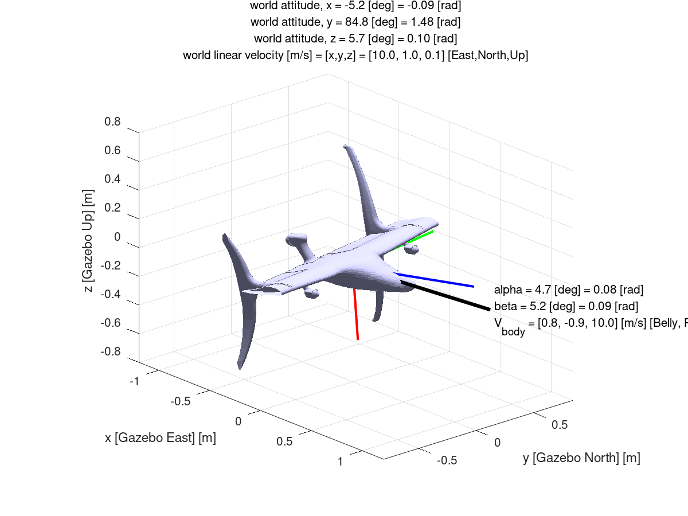
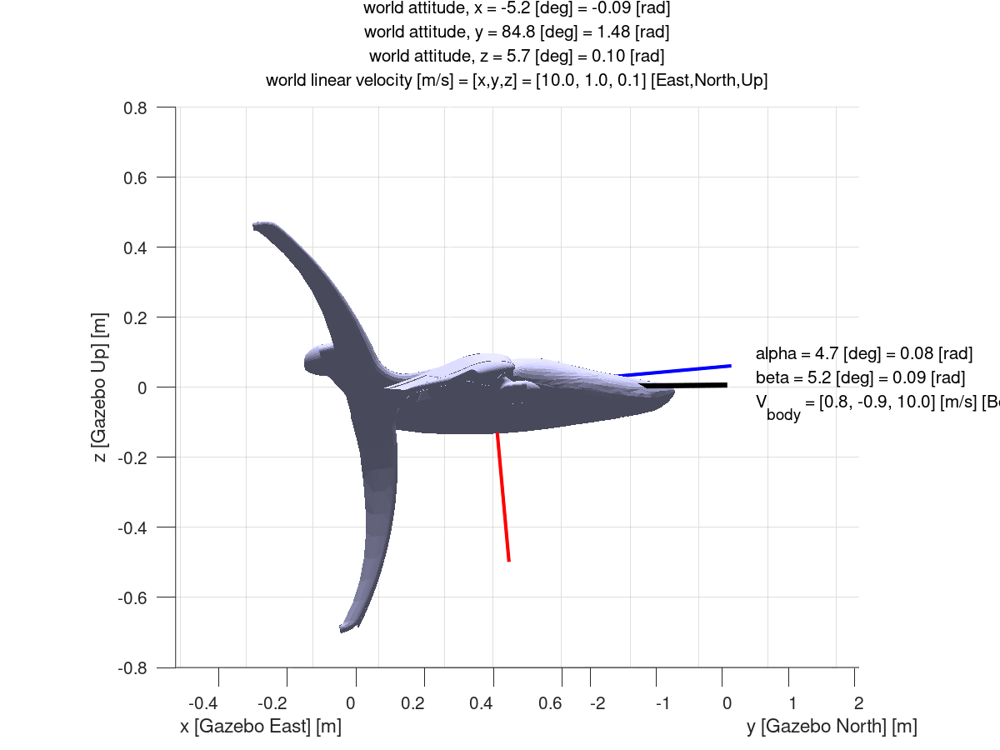
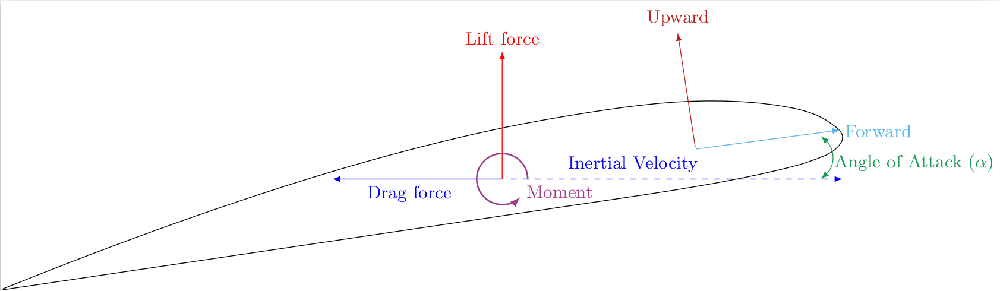
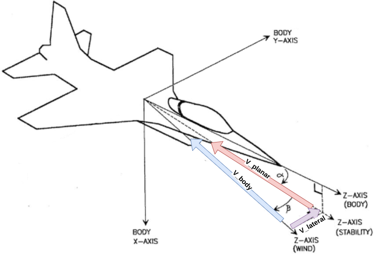
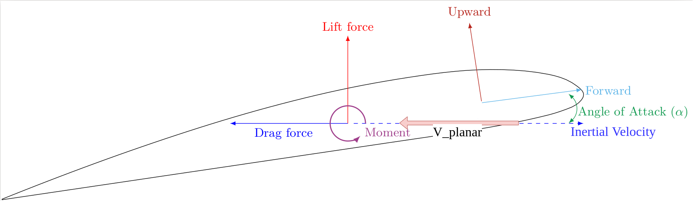

# LiftDrag Homework Problem

## Given
- Orientation$\begin{pmatrix}roll, pitch, yaw\end{pmatrix}$: $\begin{bmatrix}0.09  & 1.48  &  0.1\end{bmatrix} rad$
- Velocity, $V_{world}$: $\begin{bmatrix}10 & 1 & 0.1\end{bmatrix} \frac{m}{s}$
- Airfoil:  
  - Profile : NACA0012 (See Appendix)
  - Area, $A$ : $1 m^2$
  - Body Basis:
    - Upward:  $\begin{bmatrix} -1 &  0 & 0 \end{bmatrix}$
    - Forward: $\begin{bmatrix}  0 &  0 & 1 \end{bmatrix}$
    - Side:    $\begin{bmatrix}  0 & -1 & 0 \end{bmatrix}$
  - Lateral(Side-Slip) Drag, $C_{D-ss}$: 0.1

## Assumptions
- Air Density, $\rho$ : $1.22  \frac{kg}{m^3}$

## Find
- Resultant Force On Aircraft Body, In body frame, due to:
  - Lift
  - Drag

## Diagram

### Reference
|           Reference           |  Free Body Diagram - Body Frame   |
| :---------------------------: | :-------------------------------: |
|  |  |

### Planar-Wind/Aerodynamic Frame

|              Reference              |      Free Body Diagram - WindFrame      |
| :---------------------------------: | :-------------------------------------: |
|  |  |

### Supplemental Vector Decomposition
|        Annotated Body Frame -FBD        |            Annotated Wind Frame - FBD             |
| :-------------------------------------: | :-----------------------------------------------: |
|  |  |

## Analysis

### Transform Velocity in World Frame to Body Frame of Aircraft
We first define the quaternion representing the rotation between the world and the aircraft, 

$$
Q={(q_{yaw}q_{pitch}q_{roll})}
$$

See Appendix B , for composing a quaternion from euler angles, but using any modern calculator will resolve to the following:

$$
Q_{world \rightarrow body}=\begin{bmatrix}0.7353 & - 0.06681i & 0.6711j & 0.06719k\end{bmatrix}
$$

$$
Q^{-1}_{world \rightarrow body}=\begin{bmatrix}0.7353 & 0.06681i & -0.6711j & -0.06719k\end{bmatrix}
$$

Using the quaternion rotation and its inverse, we can now calculate $V_{body}$ using the following Hamiltonian rotations.

$$
V_{body}=Q_{world \rightarrow body} ( V_{world}*Q^{-1}_{world \rightarrow body} )
$$

Again, most devices now support quaternion-vector multiplication, using such functions, this resolves the $V_{body}$ to be:

$$
V_{body}= \begin{bmatrix} 0.81165 & -0.90368 &   9.97673 \end{bmatrix} m/s
$$

### Transform Velocity In Body Frame to Planar-Wind/Aerodynamic Frame

Referencing the aerodynamic frame diagrams above, the velocity in body is broken down into two planar wind frames:
- The plane parallel to the airfoil profile, $V_{planar}$
- The plane, $V_{lateral}$

Magnitude of Velocity Vector, $V_{\infty}$
$$
V_{\infty} = || V_{body} || = \sqrt{ {{V_{body}}_x}^2 + {{V_{body}}_y}^2 + {{V_{body}}_z}^2 } \\
V_{\infty} = \sqrt{{0.8117}^2+{-0.9037}^2 + {9.9767}^2} \\
V_{\infty} = 10.0504
$$

Planar Velocity
$$
V_{planar} = \sqrt{{{V_{body}}_x}^2+{{V_{body}}_z}^2}
$$
$$
V_{planar} = \sqrt{(0.81165\frac{m}{s})^2+(9.97673\frac{m}{s})^2}
$$
$$
V_{planar} = 10.01 \frac{m}{s}
$$

Determine angle of attack, $\alpha$
$$
\alpha = tan^{-1}(\frac{-{{V_{body}}_x}} {{V_{body}}_z})
$$
$$
\alpha = tan^{-1}(\frac{-0.8117}{9.9767})
$$
$$
\alpha = 4.651^\circ
$$

Lateral Velocity
$$
V_{lateral} = -{{V_{body}}_y} \\
V_{lateral} = -0.9037
$$

$$
\beta = sin^{-1}(\frac{V_{lateral}}{V_{\infty}}) \\
\beta = sin^{-1}(\frac{{-(-0.9037)}}{10.0504}) \\
\beta = 5.1587^\circ
$$

### Calculate Lift And Drag due to Planar Velocity

Planar dynamic pressure then is defined as
$$
q_{planar} = \frac{1}{2}\rho V_{planar}^2
$$
$$
q_{planar} = \frac{1}{2} (1.22) (10.01)^2 [\frac{kg}{m^3}][\frac{m^2}{s^2}]
$$
$$
q_{planar} = 61.122 \frac{kg}{m \cdot s^2}
$$

Note: $\frac{kg}{m \cdot s^2} = 1 Pa$ , confirming pressure through unit analysis

Calculating Lift in Aerodynamic Frame:

Using $\alpha$ and linear interpolation with Appendix A:
$$
CL = 0.511614
$$

$$
Lift = C_Lq_{planar}A \\
Lift = 0.5116 \cdot 61.122 \cdot 1 [\frac{kg}{m \cdot s^2}][m^2] \\
Lift = 31.269 N
$$

Calculating Drag in Aerodynamic Frame:

Using $\alpha$ and linear interpolation with Appendix A:
$$
CD = 0.013442
$$

$$
Drag = C_Dq_{planar}A \\
Drag = 0.0134 \cdot 61.122 \cdot 1 [\frac{kg}{m \cdot s^2}][m^2] \\
Drag = 0.821 N
$$

### Calculate Drag due to Lateral Velocity
For the purposes of calculate drag due to side slip, we use sideslip dynamic pressure.
$$
q_{ss} = \frac{1}{2} \rho {{V_{body}}_y}^2 \\
q_{ss} = \frac{1}{2} (1.22) (−0.90368)^2 [\frac{kg}{m^3}][\frac{m^2}{s^2}] \\
q_{ss} = 0.498 \frac{kg}{m \cdot s^2}
$$

$$
Drag_{ss} = C_{D-ss}q_{ss}A_{lateral} \\
Drag_{ss} = 0.1 \cdot 0.498 \cdot 0.1 [\frac{kg}{m \cdot s^2}][m^2] \\
Drag_{ss} = 0.005 N
$$

### Transform From Aerodynamic Frame Back to Body Frame
Rotating vectors from wind frame back into body frame we use basic trigonometry (refer to figure 2)
$$
F_{up} = L*cos(\alpha) + D*sin(\alpha) \\F_{fwd} = L*sin(\alpha) - D*cos(\alpha) \\
F_{up} = 31.269*cos(4.651^\circ) +  0.821 N*sin(4.651^\circ) \\F_{fwd} = 31.269*sin(4.651^\circ) - 0.821 N*cos(4.651^\circ) \\
F_{up} = 31.232 N \\ F_{fwd} = 1.716 N
$$

For the calculation of the final resultant force in body-fixed coordinate frame, convert the scalar force quantities into the appropriate directions in body-fixed coordinate frame.

$$
F_R = (F_{up} * \vec{u}_{up}) + (F_{fwd} * \vec{u}_{fwd}) + (F_{lat} * \vec{u}_{lat}) \\
F_R = (31.232 * \begin{bmatrix} -1 & 0 & 0\end{bmatrix}) + (1.716 * \begin{bmatrix} 0 & 0 & 1\end{bmatrix}) + (0.005 * \begin{bmatrix} 0 & -1 & 0\end{bmatrix}) \\
F_R = \begin{bmatrix}-31.2324 & -0.005 & 1.716\end{bmatrix} N
$$

## Result

$$
Resultant Force on Body: \begin{bmatrix}-31.2324 & -0.005 & 1.716\end{bmatrix} N
$$

# Appendix A: NACA0012 Lookup Table

| Angle of Attack$[^\circ]$ |  $C_L$   |   $C_D$ |
| ------------------------- | :------: | ------: |
| -180.0000                 | -0.0000  | 0.02500 |
| -175.00000                | 0.69000  | 0.05500 |
| -170.00000                | 0.85000  | 0.14000 |
| -165.00000                | 0.67500  | 0.23000 |
| -160.00000                | 0.66000  | 0.32000 |
| -155.00000                | 0.74000  | 0.42000 |
| -150.00000                | 0.85000  | 0.57000 |
| -145.00000                | 0.91000  | 0.75500 |
| -140.00000                | 0.94500  | 0.92500 |
| -135.00000                | 0.94500  | 1.08500 |
| -130.00000                | 0.91000  | 1.22500 |
| -125.00000                | 0.84000  | 1.35000 |
| -120.00000                | 0.73500  | 1.46500 |
| -115.00000                | 0.62500  | 1.55500 |
| -110.00000                | 0.51000  | 1.63500 |
| -105.00000                | 0.37000  | 1.70000 |
| -100.00000                | 0.22000  | 1.75000 |
| -95.00000                 | 0.07000  | 1.78000 |
| -90.00000                 | -0.07000 | 1.80000 |
| -85.00000                 | -0.22000 | 1.80000 |
| -80.00000                 | -0.37000 | 1.78000 |
| -75.00000                 | -0.51500 | 1.73500 |
| -70.00000                 | -0.65000 | 1.66500 |
| -65.00000                 | -0.76500 | 1.57500 |
| -60.00000                 | -0.87500 | 1.47000 |
| -55.00000                 | -0.96500 | 1.34500 |
| -50.00000                 | -1.04000 | 1.21500 |
| -45.00000                 | -1.08500 | 1.07500 |
| -40.00000                 | -1.07500 | 0.92000 |
| -35.00000                 | -1.02000 | 0.74500 |
| -30.00000                 | -0.91500 | 0.57000 |
| -27.00000                 | -0.96460 | 0.47300 |
| -26.00000                 | -0.91090 | 0.44600 |
| -25.00000                 | -0.85720 | 0.42000 |
| -24.00000                 | -0.80340 | 0.39400 |
| -23.00000                 | -0.74970 | 0.36900 |
| -22.00000                 | -0.69560 | 0.34400 |
| -21.00000                 | -0.64140 | 0.32000 |
| -20.00000                 | -0.58700 | 0.29700 |
| -19.00000                 | -0.53220 | 0.27400 |
| -18.00000                 | -0.47680 | 0.25200 |
| -17.00000                 | -0.42000 | 0.23100 |
| -16.00000                 | -0.36200 | 0.21000 |
| -15.00000                 | -0.30820 | 0.19000 |
| -14.00000                 | -0.25460 | 0.17100 |
| -13.00000                 | -0.20300 | 0.15200 |
| -12.00000                 | -0.15330 | 0.13400 |
| -11.00000                 | -0.10950 | 0.07600 |
| -10.00000                 | -0.13250 | 0.01880 |
| -9.00000                  | -0.85270 | 0.02030 |
| -8.00000                  | -0.82740 | 0.01850 |
| -7.00000                  | -0.74600 | 0.01700 |
| -6.00000                  | -0.66000 | 0.01520 |
| -5.00000                  | -0.55000 | 0.01400 |
| -4.00000                  | -0.44000 | 0.01240 |
| -3.00000                  | -0.33000 | 0.01140 |
| -2.00000                  | -0.22000 | 0.01080 |
| -1.00000                  | -0.11000 | 0.01040 |
| 0.00000                   | 0.00000  | 0.01030 |
| 1.00000                   | 0.11000  | 0.01040 |
| 2.00000                   | 0.22000  | 0.01080 |
| 3.00000                   | 0.33000  | 0.01140 |
| 4.00000                   | 0.44000  | 0.01240 |
| 5.00000                   | 0.55000  | 0.01400 |
| 6.00000                   | 0.66000  | 0.01520 |
| 7.00000                   | 0.74600  | 0.01700 |
| 8.00000                   | 0.82740  | 0.01850 |
| 9.00000                   | 0.85270  | 0.02030 |
| 10.00000                  | 0.13250  | 0.01880 |
| 11.00000                  | 0.10950  | 0.07600 |
| 12.00000                  | 0.15330  | 0.13400 |
| 13.00000                  | 0.20300  | 0.15200 |
| 14.00000                  | 0.25460  | 0.17100 |
| 15.00000                  | 0.30820  | 0.19000 |
| 16.00000                  | 0.36200  | 0.21000 |
| 17.00000                  | 0.42000  | 0.23100 |
| 18.00000                  | 0.47680  | 0.25200 |
| 19.00000                  | 0.53220  | 0.27400 |
| 20.00000                  | 0.58700  | 0.29700 |
| 21.00000                  | 0.64140  | 0.32000 |
| 22.00000                  | 0.69560  | 0.34400 |
| 23.00000                  | 0.74970  | 0.36900 |
| 24.00000                  | 0.80340  | 0.39400 |
| 25.00000                  | 0.85720  | 0.42000 |
| 26.00000                  | 0.91090  | 0.44600 |
| 27.00000                  | 0.96460  | 0.47300 |
| 30.00000                  | 0.91500  | 0.57000 |
| 35.00000                  | 1.02000  | 0.74500 |
| 40.00000                  | 1.07500  | 0.92000 |
| 45.00000                  | 1.08500  | 1.07500 |
| 50.00000                  | 1.04000  | 1.21500 |
| 55.00000                  | 0.96500  | 1.34500 |
| 60.00000                  | 0.87500  | 1.47000 |
| 65.00000                  | 0.76500  | 1.57500 |
| 70.00000                  | 0.65000  | 1.66500 |
| 75.00000                  | 0.51500  | 1.73500 |
| 80.00000                  | 0.37000  | 1.78000 |
| 85.00000                  | 0.22000  | 1.80000 |
| 90.00000                  | 0.07000  | 1.80000 |
| 95.00000                  | -0.07000 | 1.78000 |
| 100.00000                 | -0.22000 | 1.75000 |
| 105.00000                 | -0.37000 | 1.70000 |
| 110.00000                 | -0.51000 | 1.63500 |
| 115.00000                 | -0.62500 | 1.55500 |
| 120.00000                 | -0.73500 | 1.46500 |
| 125.00000                 | -0.84000 | 1.35000 |
| 130.00000                 | -0.91000 | 1.22500 |
| 135.00000                 | -0.94500 | 1.08500 |
| 140.00000                 | -0.94500 | 0.92500 |
| 145.00000                 | -0.91000 | 0.75500 |
| 150.00000                 | -0.85000 | 0.57000 |
| 155.00000                 | -0.74000 | 0.42000 |
| 160.00000                 | -0.66000 | 0.32000 |
| 165.00000                 | -0.67500 | 0.23000 |
| 170.00000                 | -0.85000 | 0.14000 |
| 175.00000                 | -0.69000 | 0.05500 |
| 180.00000                 | 0.00000  | 0.02500 |

# Appendix B: Euler Angles to Quaternion
Translating Euler angles into a quaternion representation of the rotation follows:

Assuming the angles for roll, pitch, and yaw are provided in radians, then it follows that 

Given:
$$
\phi = \frac{roll}{2}\\
\theta = \frac{pitch}{2}\\
\psi = \frac{yaw}{2}
$$

Then
$$
Q_w = cos(\phi) * cos(\theta) * cos(\psi) + sin(\phi) * sin(\theta) * sin(\psi)\\
Q_x = sin(\phi) * cos(\theta) * cos(\psi) - cos(\phi) * sin(\theta) * sin(\psi)\\
Q_y = cos(\phi) * sin(\theta) * cos(\psi) + sin(\phi) * cos(\theta) * sin(\psi)\\
Q_z = cos(\phi) * cos(\theta) * sin(\psi) - sin(\phi) * sin(\theta) * cos(\psi)
$$

# Appendix C: Hamiltonian Vector-Quaternion Multiplication
Given some vector $V_a$ and a reference given by the quaternion $Q=Q_{a \rightarrow b}$, the Vector represented in the reference frame is defined as:

$$
V_b = Q \cdot V_a \cdot Q^{-1} 
$$

This is solved by translating $V_a$ into a quaternion $Q_V$ defined as:
$$
Q_V = 0 + V_x i + V_y j + V_z k
$$

From there the hamiltonian products reduce down into the following condensed form:

$$
\textit{Given a Vector U, such that:} \\
U = \begin{bmatrix} Q_x & Q_y & Q_z\end{bmatrix} \\
V_b = 2 (U \cdot V_a)  U + (Q^2_w - U \cdot U) V_a + 2 Q_w ( U \times V_a);
$$

Alternatively, this reduces further down to a more discrete form as follows:
$$
V_{b-x} = 2 (Q_w V_{a-z} Q_y + Q_x V_{a-z} Q_z - Q_w V_{a-y} Q_z + Q_x V_{a-y} Q_y) + V_{a-x} (Q_w^2 + Q_x^2 - Q_y^2 - Q_z^2) \\
V_{b-y} = 2 (Q_w V_{a-x} Q_z + Q_x V_{a-x} Q_y - Q_w V_{a-z} Q_x + Q_y V_{a-z} Q_z) + V_{a-y} (Q_w^2 - Q_x^2 + Q_y^2 - Q_z^2) \\
V_{b-z} = 2 (Q_w V_{a-y} Q_x - Q_w V_{a-x} Q_y + Q_x V_{a-x} Q_z + Q_y V_{a-y} Q_z) + V_{a-z} (Q_w^2 - Q_x^2 - Q_y^2 + Q_z^2)
$$